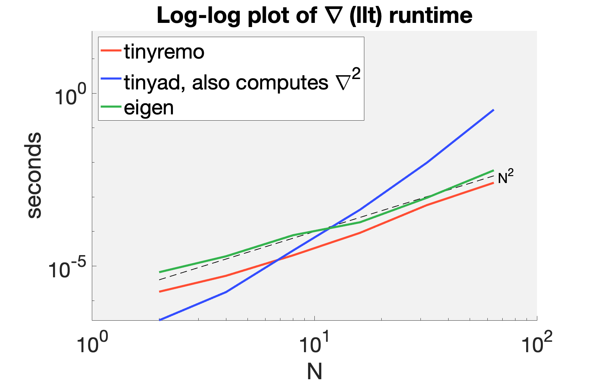
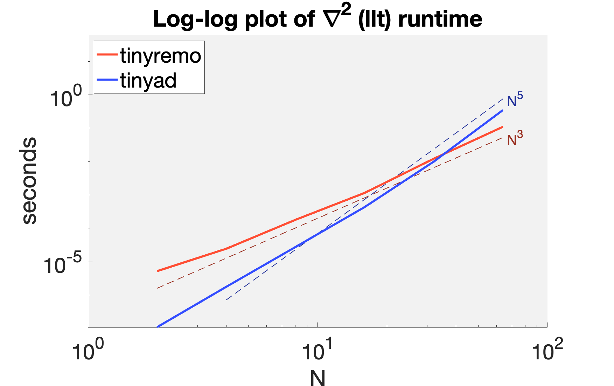

# 🥁 TinyReMo 🥁 - Comparison Branch

Differentiating through Eigen's LLT decomposition for dense matrices has been
useful for uncovering performance [issues with other
reverse-mode libraries](https://github.com/autodiff/autodiff/issues/332).

tinyremo demonstrates good performance trend when computing gradients on such a
function. In this plot, we compare to `unsupported/Eigen/Autodiff` (forward-mode
autodiff for first-derivatives) and `tinyad (forward-mode for first- and
second-derivatives)`. [TinyAD](https://github.com/patr-schm/TinyAD) always
computes the Hessian even if it's not used, like here (hence the poor
performance). tinyremo consistently beats eigen on this problem; both show good
performance trend.



Now, let's consider computing the (dense) Hessian. `unsupported/Eigen/Autodiff`
does not fully support nesting its type and fails to compile on this function,
so it is omitted. TinyAD shows good performance for small, fixed sizes, but the
trend is bad and eventually over taken by tinyremo.





## Build and Run the comparison

```bash
mkdir build
cd build
cmake .. -DCMAKE_BUILD_TYPE=Release
make
./comparison
```

In matlab, you can generate these plots by updating the data in `gen_plots.m` and running it.
